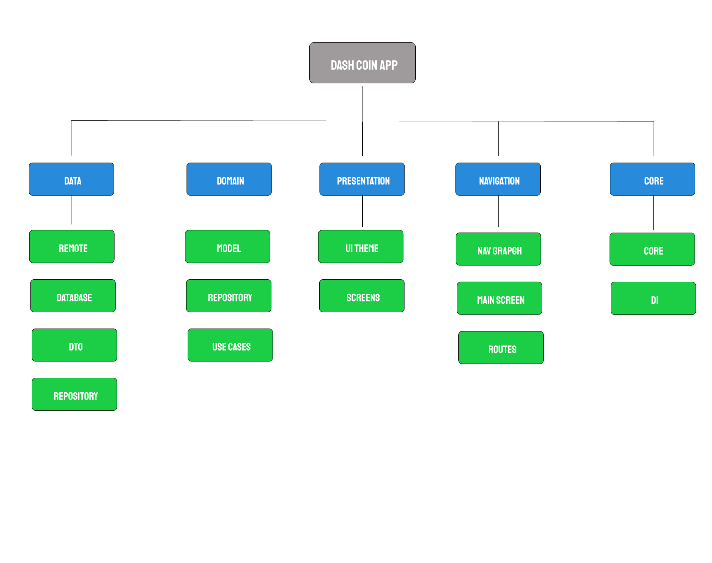
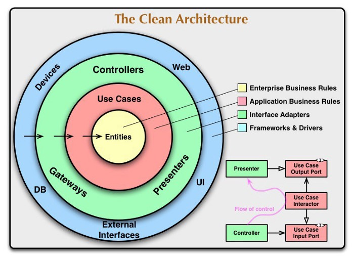

# **Dash Coin** 

### **DashCoin** is a crypto currency tracker with jetpack compose and clean architecture

This project is developed by **MathRoda** for more projects [GitHub](https://github.com/MathRoda/) .

# Blog ✍

i documented my journey and thoughts for the development process , read my article on https://medium.com/@mathroda/crypto-currency-tracker-with-jetpack-compose-clean-architecture-e93a4330a76d

## Application Install

***You can Install and test latest DashCoin app from below 👇***

# Showcase Video
watch video here [DashCoin Showcase](https://youtu.be/Y8FlGuVJOg8)

## About
 
- Clean and Simple UI with Jetpack Compose.
- Best and Clean Code Quality following Modern Android Development
- Clean Architecture Approach by uncle bob

## Insights into the app 🔎

## 📸 Screenshots 

|   |   |   |
|---|---|---|
||  | 
| |  | 

### Technical details 

- DashCoin uses an open opi from [Coin Stats](https://coinstats.app)
- DashCoin uses Retrofit to make api requests to coinstats.
- DashCoin is made using Kotlin & Jetpack Compose and following Modern Android Development practices.
- DashCoin uses Room to store users favorite coins for watchlist feature
- DashCoin uses chart visuals library to view market changes by [MPAndroidCharts](https://github.com/PhilJay/MPAndroidChart)
- DashCoin uses Kotlin Coroutines and Flow to handle all asynchronous tasks.
- DashCoin uses all Jetpack libraries and follows clean architecture. It also has a G.O.A.T rating in Android's  M.A.D scorecard.

## Built With 🛠
- [Kotlin](https://kotlinlang.org/) - First class and official programming language for Android development.
- [Jetpack Compose](https://developer.android.com/jetpack/compose) - Jetpack Compose is Android’s modern toolkit for building native UI
- [Coroutines](https://kotlinlang.org/docs/reference/coroutines-overview.html) - For asynchronous and more..
- [Flow](https://kotlin.github.io/kotlinx.coroutines/kotlinx-coroutines-core/kotlinx.coroutines.flow/-flow/) - A cold asynchronous data stream that sequentially emits values and completes normally or with an exception.
 - [StateFlow](https://developer.android.com/kotlin/flow/stateflow-and-sharedflow) - StateFlow is a state-holder observable flow that emits the current and new state updates to its collectors.
- [Android Architecture Components](https://developer.android.com/topic/libraries/architecture) - Collection of libraries that help you design robust, testable, and maintainable apps.
  - [ViewModel](https://developer.android.com/topic/libraries/architecture/viewmodel) - Stores UI-related data that isn't destroyed on UI changes. 
- [Dependency Injection](https://developer.android.com/training/dependency-injection) - 
  - [Hilt-Dagger](https://dagger.dev/hilt/) - Standard library to incorporate Dagger dependency injection into an Android application.
  - [Hilt-ViewModel](https://developer.android.com/training/dependency-injection/hilt-jetpack) - DI for injecting `ViewModel`.
- [GSON](https://github.com/google/gson) - A modern JSON library for Kotlin and Java.
- [Retrofit](https://square.github.io/retrofit/) - A type-safe HTTP client for Android and Java.
- [Room](https://developer.android.com/jetpack/androidx/releases/room) - an abstraction layer over SQLite to allow for more robust database access while harnessing the full power of SQLite.
- [GSON Converter](https://github.com/square/retrofit/tree/master/retrofit-converters/gson) - A Converter which uses Moshi for serialization to and from JSON.
- [Coil](https://github.com/coil-kt/coil) - An image loading library for Android backed by Kotlin Coroutines.
- [Material Components for Android](https://github.com/material-components/material-components-android) - Modular and customizable Material Design UI components for Android.

## Package Structure

    

## Architecture
This app uses [***Clean Architecture***](https://medium.com/android-dev-hacks/detailed-guide-on-android-clean-architecture-9eab262a9011) .

  

---

## If you like my projects you can buy me a cup of coffee
  

 ## Contact
you can connect with me here [LinkedIn](https://www.linkedin.com/in/mathroda/) .

